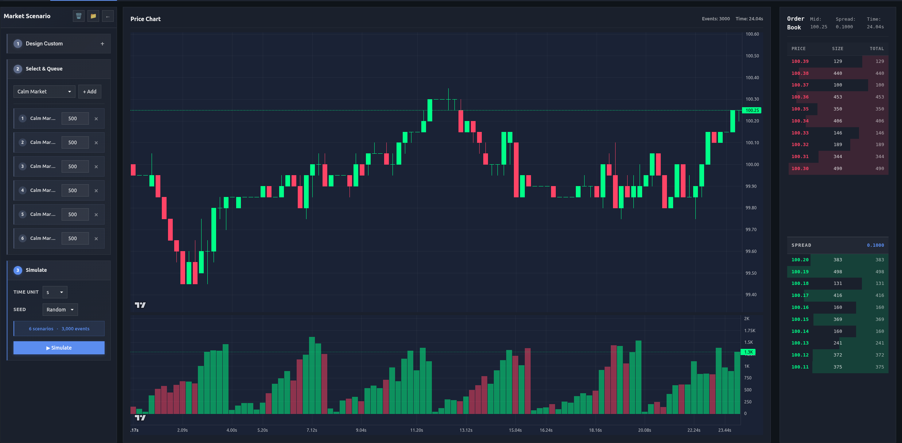

# Hawkes LOB Simulator

> A full-stack, interactive Limit Order Book simulator driven by multivariate Hawkes processes.



---

## Live Demo
A public live demo will be deployed soon.

---
## Overview

This project is a **research-grade simulation and experimentation platform** for market microstructure and algorithmic trading.  
It combines a high‑performance **C++ limit order book engine**, exposed to Python via **pybind11**, wrapped into a **Flask API**, and visualized through a **React-based interactive web interface**.

The goal is to provide a realistic environment to:
- Study order flow dynamics
- Experiment with Hawkes-process-based market models
- Design and test algorithmic trading strategies
- Explore scientific software engineering practices

---

## What does the project do?

The simulator implements a **Limit Order Book (LOB)** where order arrivals are generated by a **multivariate Hawkes process**.  
Six event types drive the market dynamics:

- Market Buy (MB)
- Market Sell (MS)
- Limit Buy (LB)
- Limit Sell (LS)
- Cancel Buy (CB)
- Cancel Sell (CS)

Users can:
- Simulate multiple market regimes
- Create custom regimes by modifying Hawkes parameters (μ, α, β)
- Observe evolving market variables (mid, spread, best bid/ask, volume, returns)
- Design trading strategies using a custom expression language
- Backtest strategies and evaluate performance metrics
- Run Monte Carlo experiments

The platform provides an **interactive UI** where users can visually explore price dynamics, order book state, and strategy performance.

---

## Architecture

The project is structured as a multi-layer research system, similar to real-world quantitative research platforms:

C++ simulation engine  
→ Python bindings (pybind11)  
→ Python research & backtesting layer  
→ Flask REST API  
→ React frontend  
→ Dockerized deployment

This separation allows:
- High performance at the core
- Rapid experimentation in Python
- Clean API boundaries
- Reproducible deployment via containers

---

## Technologies Used

**Core engine**
- C++17
- Custom Limit Order Book implementation
- Multivariate Hawkes process simulation

**Bindings & Research**
- pybind11
- Python (NumPy, pandas)

**Backend**
- Flask (REST API)
- Gunicorn

**Frontend**
- React
- JavaScript
- Interactive visualization components

**Infrastructure**
- Docker
- CMake
- Linux development environment

---

## Quick Start

```
Backend:
docker build -t lob-backend .
docker run -p 5000:5000 lob-backend

Frontend:
cd frontend
npm install
npm start
```


The frontend connects to the backend via HTTP requests.

---

## Project Structure

```
cpp/                  C++ simulation engine
python/               Python research, backtesting, API
python/bindings/      pybind11 bindings
frontend/             React user interface
Dockerfile            Backend container configuration
CMakeLists.txt        Build system
```

---


## Motivation

This project was built as a personal research and engineering platform to deepen my understanding of:

- Market microstructure
- Hawkes-process-based order flow modeling
- Algorithmic trading research workflows
- High-performance scientific computing
- Multi-language system design (C++ / Python / Web)
- Reproducible deployment practices

It also serves as a concrete demonstration of research software engineering skills.

---

## Status

The system is fully functional and actively evolving.  
Architecture is stable; models and features continue to improve over time.

---

## License

MIT (or your preferred license)

---
